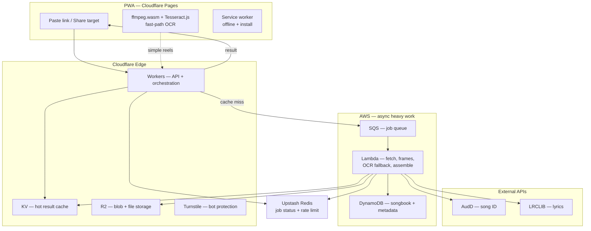
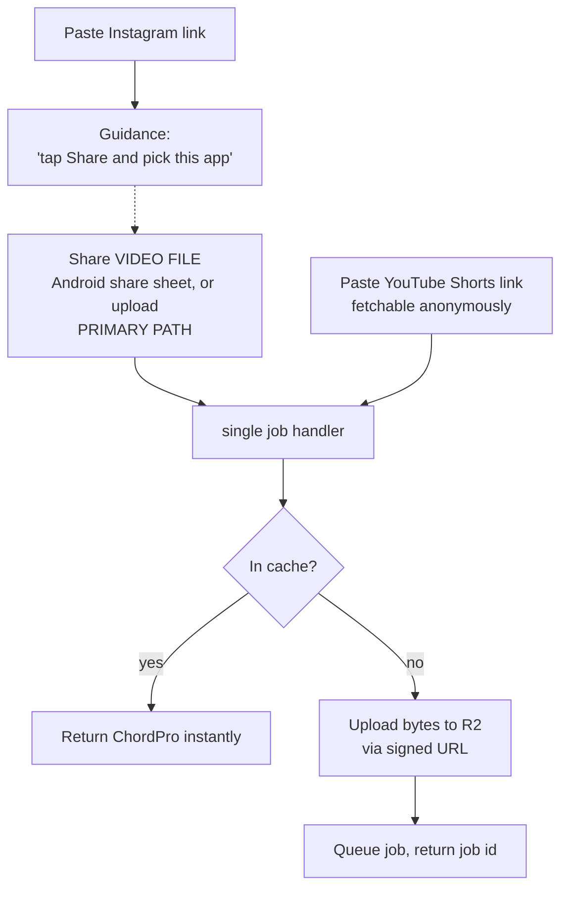
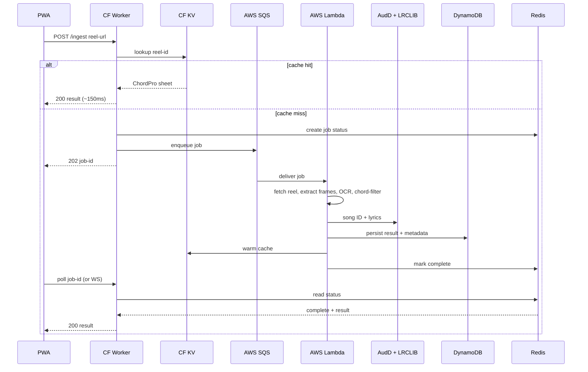

# ReelChords — Project Plan

Turn a guitar-tutorial reel into a saved, text-format chord + lyric sheet.
Paste a reel link → the app reads the chords shown on screen, identifies the song,
fetches lyrics, and returns a clean ChordPro sheet you can store and reuse.

Built as a **PWA** on a **Cloudflare + AWS** stack, entirely on free tiers, and
designed to stay live indefinitely for a portfolio demo.

---

## 0. Spike results — read this first (2026-07-26)

Two throwaway experiments were run before any infrastructure was built, to test
the assumptions everything else depends on. Both changed the plan.

**Spike 1 — media acquisition ([spike/FINDINGS.md](spike/FINDINGS.md))**
Instagram **refuses anonymous automated access** to reel media (`empty media
response`); a YouTube control request succeeded, proving the tooling was fine.
Server-side fetching from Lambda — as drawn in §2/§5/§6 — is not viable without
storing personal Instagram credentials on a datacenter IP.

*Resolution:* the PWA's `share_target` accepts **the video file itself**, not just
a link. Sharing a reel to the app still works exactly as intended from the user's
point of view; the app simply receives bytes instead of fetching them. YouTube
Shorts URLs are supported directly. **Lambda's "fetch reel" step disappears**,
which makes the architecture simpler and removes its largest external dependency.

**Spike 2 — chord OCR ([spike/FINDINGS_OCR.md](spike/FINDINGS_OCR.md))**
Ran the real pipeline on a real tutorial Short: 53 frames, 0.16 s/frame, correctly
extracted the progression `Em → D6-9/F#`. **The core product assumption holds.**

The important surprise: OCR read the chord `D6-9/F#` *perfectly* in all 11 frames,
and the **chord-grammar filter rejected it** because the regex lacked a rule for
`-` between extensions. Fixing the grammar nearly tripled the chord-frame count.

> **The bottleneck is grammar coverage, not character recognition.**
> This reverses §11's risk ranking and promotes the "chord filter as remote
> config" idea from a Phase-5 nicety to an early, high-value feature.

---

## 1. What it does (scope)

- **Input:** an Instagram reel link (paste is the universal path; Android also gets share-sheet).
- **Core trick:** OCR the chord *text/diagrams shown on screen* in the tutorial — not chords guessed from audio — so the output matches what the creator is actually teaching.
- **Enrichment:** identify the song (audio fingerprint) and pull matching lyrics.
- **Output:** a ChordPro-format sheet (`[G]Twinkle [C]little [G]star`) rendered in-app and saved to a personal songbook.

Out of scope for v1: chord *audio* detection, real-time video, multi-user collaboration.

---

## 2. Architecture at a glance



**The one-line summary:** Cloudflare serves the app and handles fast/cached
requests at the edge; AWS does the slow, heavy, asynchronous work; external
APIs supply song identity and lyrics; Redis tracks live job state.

---

## 3. Service stack — every piece and why it's there

| Layer | Service | Role in this app | Free tier | Résumé keyword |
|---|---|---|---|---|
| PWA hosting | **Cloudflare Pages** | Serve the installable PWA, global CDN, auto HTTPS | Unlimited sites, 100 GB/mo bandwidth | Cloudflare Pages, PWA |
| Edge API | **Cloudflare Workers** | Ingest paste/share, orchestrate, serve cached results at the edge | 100k requests/day | Edge compute, serverless |
| Hot cache | **Cloudflare KV** | `reel-id → ChordPro` cache for instant repeat hits | 100k reads/day, 1k writes/day | Edge caching |
| Object storage | **Cloudflare R2** | Transient audio/frames + generated `.cho` files, zero egress fees | 10 GB storage | Object storage, S3-compatible |
| Bot protection | **Cloudflare Turnstile** | Guard the ingest endpoint from abuse | Free | Turnstile / CAPTCHA |
| Job queue | **AWS SQS** | Decouple API from heavy workers (async pipeline) | 1M requests/mo (always free) | SQS, message queue |
| Compute | **AWS Lambda** | Fetch reel, extract frames, server-side OCR fallback, chord filter, assemble | 1M req + 400k GB-s/mo (always free) | AWS Lambda, serverless |
| Durable store | **AWS DynamoDB** | User accounts, saved songbooks, processed-song metadata | 25 GB + 25 RCU/WCU (always free) | DynamoDB, NoSQL |
| Live state | **Upstash Redis** | Job-status tracking, progress pub/sub, rate-limit counters | Serverless, generous free tier | Redis |
| Song ID | **AudD API** | Audio fingerprint → track + artist | 300 free requests, then $5/1k | Audio fingerprinting |
| Lyrics | **LRCLIB** | Free, open, synced lyrics (no key) | Free | API integration |
| Client OCR | **Tesseract.js + ffmpeg.wasm** | Fast-path, in-browser frame extraction + OCR | Free / open source | WebAssembly, on-device ML |
| CI/CD | **GitHub Actions** | Lint, test, deploy Pages + Lambda on push | Free on public repos | CI/CD |

> **Note on AWS "always free":** every AWS service above (Lambda, SQS, DynamoDB) is
> in the *always-free* category — monthly allowances that reset and never expire.
> This is deliberate: the July 2025 AWS free-tier overhaul gives new accounts only
> **$200 in credits for 6 months, after which a Free-Plan account closes**. By using
> only always-free services (and keeping EC2/RDS out of the design), the project
> survives indefinitely with no auto-close and no surprise bill.

---

## 4. Input flow — three entry points, one pipeline

**Revised after Spike 1.** The original design assumed a link was always enough.
It isn't: Instagram blocks server-side fetching. The fix is that the share sheet
can hand over **the video file**, which sidesteps fetching entirely.



| Entry point | App receives | Works? |
|---|---|---|
| Share **video file** from gallery / upload (all) | video bytes | ✅ primary |
| **YouTube Shorts** URL | URL, fetched server-side | ✅ verified in spike |
| **Instagram** URL | URL | ❌ can't fetch — show guidance |

> **Real-device correction (2026-07-29):** Instagram's own share sheet only
> shares the URL — it never offers the video file to external apps. The
> working flow is one extra tap: Instagram **Share → Download** (saves to
> gallery), then share the saved file from the gallery to ReelChords or pick
> it in-app. The share-target plumbing itself was verified working on real
> Android hardware. See spike/FINDINGS.md addendum.

The manifest declares `share_target` with `accept: ["video/*"]` **and**
`text/plain`, so Android offers the app for both. iOS ignores share targets
entirely, so its users get the paste/upload form — which is always visible anyway.

**Cache key note:** with file uploads there's no reel ID to key on, so the cache
key becomes a **content hash** of the uploaded video. This works better than the
original scheme: the same reel shared by two different users hits the same cache
entry even though their URLs differ.

---

## 5. Request lifecycle — cache hit vs miss



---

## 6. The processing pipeline (inside Lambda / WASM)

1. **Acquire** — *revised.* Either the user's uploaded/shared video (primary) or a
   YouTube Shorts URL resolved server-side. Instagram is never fetched. Low-res is
   fine — frames only need to be legible, not HD.
2. **Sample frames** — ffmpeg samples on visual change, ~2–4 fps, so a 30s reel is ~60–120 images, not 900.
   *Spike note:* 1 fps was sufficient on the test video; 2× upscale + grayscale
   measurably helped OCR.
2b. **Crop to the overlay region** — *new, from Spike 2.* Chord text consistently
   sits in the top ~15–25% of the frame; the rest is the person and their room.
   Cropping before OCR cuts noise tokens sharply and speeds up recognition.
   Cheap to implement, meaningful accuracy win.
3. **OCR** — read text + bounding boxes + timestamp per frame. Client fast-path uses Tesseract.js; heavy reels fall back to Lambda.
   *Spike baseline:* Tesseract 5.4 `--psm 11` (sparse text) at **0.16 s/frame** native.
4. **Chord-grammar filter** — validate every token against a chord regex/whitelist (root + accidental + quality + extension + optional /bass). This separates chords from lyrics **and** error-corrects OCR (constrained vocabulary = correction dictionary).
   **⚠ This is the top functional risk, per Spike 2 — not OCR itself.** The grammar
   must cover extension separators (`D6-9/F#`, `C6/9`), alterations (`F#m7b5`,
   `E7#9`), and slash bass notes. Ship it as **remote config from day one** so
   coverage gaps are fixable without a redeploy. A working 43-test starting
   grammar exists in [spike/ocr_chords.py](spike/ocr_chords.py).
4b. **Threshold by occurrence** — *new.* Chords appearing in only 1–2 frames are
   usually partial reads during an overlay transition (the spike saw `Em` misread
   as `E` and `F`). Requiring ≥3 frames removes them.
5. **Collapse time** — merge consecutive identical chords into `{chord, start, end}` events → ordered progression.
6. **Detect layout** — static list (whole progression printed once → easy) vs time-synced (chord flashes when played → gives real timing).
7. **Song ID + lyrics** — fingerprint audio via AudD (in parallel with OCR), fetch synced lyrics from LRCLIB.
8. **Align + assemble** — place each chord before the lyric word nearest its timestamp → ChordPro sheet.
9. **Store** — DynamoDB (durable) + KV (cache) + R2 (`.cho` file).

**Latency target:** cache hit < 200 ms; cold miss ~3–4 s by running fetch, OCR,
and song-ID in parallel rather than in series.

---

## 7. Data model (DynamoDB, single-table)

| PK | SK | Attributes |
|---|---|---|
| `USER#<id>` | `PROFILE` | email, created_at |
| `USER#<id>` | `SONG#<songId>` | title, artist, chordpro, source_reel, saved_at |
| `REEL#<reelId>` | `RESULT` | chordpro, song_id, confidence, processed_at (also cached in KV) |
| `SONG#<songId>` | `META` | title, artist, lyrics_ref, canonical_key |

Single-table keeps you inside the always-free DynamoDB limits and is itself a
strong "I understand NoSQL access patterns" résumé signal.

---

## 8. Repo structure

```
reelchords/
├── apps/
│   ├── pwa/                  # Vite + React, service worker, manifest, WASM OCR
│   └── worker/               # Cloudflare Worker (edge API)
├── services/
│   └── processor/            # AWS Lambda handler (fetch, frames, OCR, assemble)
├── packages/
│   └── chord-core/           # shared chord-grammar filter + ChordPro builder
├── infra/
│   ├── cloudflare/           # wrangler.toml, KV/R2 bindings
│   └── aws/                  # SAM or Terraform: Lambda, SQS, DynamoDB
├── .github/workflows/        # CI/CD
├── ARCHITECTURE.md
└── README.md
```

---

## 9. Phased build plan

**Phase 0 — Foundation (weekend)**
Repo + monorepo setup, Cloudflare Pages deploy of an empty PWA (installable, manifest, service worker), AWS account with always-free services, GitHub Actions deploying both. *Milestone: blank PWA live at a URL, CI green.*

**Phase 1 — Vertical slice (week 1)**
Paste a link → Worker → Lambda fetches audio → AudD song ID → LRCLIB lyrics → return song + lyrics (no chords yet). *Milestone: paste a reel, get the right song and lyrics back.*

**Phase 2 — The core (weeks 2–3)**
ffmpeg frame extraction, OCR (Tesseract.js client-side + Lambda fallback), the chord-grammar filter, static-list layout handling. *Milestone: paste a tutorial reel, get its chords as text.* This is the novel part — give it the most polish.

**Phase 3 — Scale + speed (week 4)**
SQS async queue, Redis job status, KV result cache, parallelized pipeline, progressive UI (song appears first, chords stream in). *Milestone: repeat requests return < 200 ms; the pipeline is fully async.*

**Phase 4 — Songbook + PWA polish (week 5)**
DynamoDB save/load, ChordPro export, offline access, transpose/capo, Android share-target enhancement, alignment of chords to lyric syllables. *Milestone: save a sheet, close the app, reopen offline, it's there.*

**Phase 5 — Hardening + story (week 6)**
Turnstile + Redis rate limiting, observability/latency logging, `ARCHITECTURE.md`, README with the metrics and the ToS/copyright note. *Milestone: a repo a recruiter can read and a demo they can click.*

---

## 10. Résumé talking points (capture these as you build)

- "Designed a **serverless, event-driven pipeline** across Cloudflare Workers and AWS Lambda/SQS, processing video into structured text."
- "Cut P95 latency from ~4 s to **< 200 ms** via edge caching (Cloudflare KV) keyed on content ID."
- "Ran **OCR in WebAssembly** (Tesseract.js + ffmpeg.wasm) on-device to offload compute and scale per-user at zero server cost."
- "Built a **domain-specific error-correction layer** (chord-grammar validation) that both classifies and repairs OCR output."
- "Modeled access patterns in **single-table DynamoDB**; stayed entirely within always-free tiers for indefinite uptime."
- "Shipped an **installable PWA** with offline support and platform-adaptive input (share-target on Android, paste everywhere)."

Keep a short metrics log (latency before/after cache, OCR accuracy on a test set of
reels, cost per 1k requests) — concrete numbers are what make the résumé line land.

---

## 11. Risks & honest caveats

> **Updated 2026-07-26 after spikes.** The top two risks below were both
> *measured*, and both moved. See §0.

- **~~Instagram fetch / ToS~~ → RESOLVED by design change.** Spike 1 confirmed
  Instagram refuses anonymous automated access outright. Rather than fight it with
  stored credentials, the app now receives **the shared video file** and never
  fetches from Instagram at all. This removes the ToS grey area *and* the
  reliability problem in one move. Documented in [spike/FINDINGS.md](spike/FINDINGS.md).
- **Copyright:** lyrics and music are copyrighted. LRCLIB for lyrics and fingerprint-only audio handling keep you clean; don't store or redistribute full audio.
- **~~OCR accuracy~~ → downgraded; chord-grammar coverage promoted.** Spike 2 found
  Tesseract read a complex chord (`D6-9/F#`) with perfect accuracy while the
  *grammar filter* rejected it. On clean digital overlays, recognition is not the
  bottleneck — **vocabulary coverage is**. Ship the filter as remote config early
  (it was Phase 5; it should be Phase 2). Genuinely stylized or handwritten
  overlays remain untested and are still a real risk.
- **AWS credit expiry:** stay on always-free services only; set an AWS Budget alert at $1 as a guardrail.
- **iOS gaps:** no share-target, no App Store listing for a PWA. Paste flow + Add-to-Home-Screen covers it; Android can wrap to Play Store via TWA later.

---

## 12. Stretch goals (after v1)

- Time-synced chord alignment using OCR timestamps + Whisper word timings.
- Chord-diagram (fretboard grid) recognition via a small vision model, not just text OCR.
- Multi-source input (YouTube Shorts, TikTok) behind the same pipeline.
- Community songbook with shared, versioned arrangements.
- Auto-transpose and capo suggestions per user vocal range.
